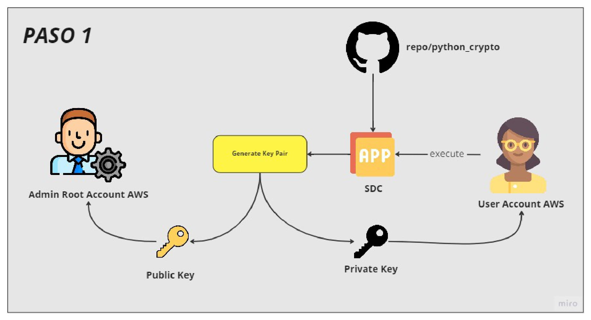
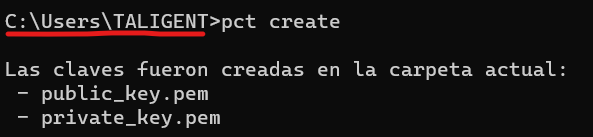

# python_crypto
## Secure Delivery of Credentials

### Attacking

Actualmente el robo de credenciales es muy frecuente, ya que los atacantes logran tener acceso al correo o los servicios de mensajería, obteniendo en texto plano nuestra credencial.
Principalmente los mayores ataques se dan a las cuentas Cloud como es el caso de AWS, Azure o GCP.
El administrador root de la cuenta, cuando genera un nuevo usuario, este mismo debe proveer la credencial, utilizando canales de comunicación poco seguros, debido a esto los atacantes logran obtener la credencial y hacer uso de los servicio y recursos Cloud para sus beneficios.

### Asymmetric Encryption

La criptografía asimétrica es uno de los tipos de criptografía informática y una de las técnicas de criptografía más potentes diseñadas en base al uso de una fórmula matemática muy compleja para crear un par de claves: la clave privada y la clave pública. A través de estas claves se establece un canal de comunicación seguro entre las partes, en el que tanto el emisor como el receptor deben usar criptografía asimétrica con un mismo algoritmo definido, que les permitirá crear un juego de claves único e irrepetible para cada uno.

En ese proceso de comunicación, el emisor y el receptor comparten entre ellos sus claves públicas; estas claves cifrarán posteriormente los mensajes que intercambien entre ellos. Y las claves privadas descifrarán esos mensajes para poder ver su contenido. Este proceso hace imposible que un tercero puede interferir en la comunicación y ver el contenido los mensajes.

## Aplication PyCrypto-Tali

El proyecto SDC o Secure delivery of credentials, ofrece una solución al problema de un envió seguro, generando un cifrado de encriptación RSA, creando una llave publica y una privada para el cifrado. Como tambien un des encriptación de la credencial.

Se utiliza una libreria command line interface o cli.

### Paso 1

Primero el usuario debe generar sus propias credenciales a traves de la libreria, compartiendo la clave publica con el Administrador Root, ya que esta llave solo cifra el texto.

**El usuario NO DEBE COMPARTI, NI ALMACENAR EN DRIVE su clave privada, de lo contrario se podria acceder al documento cifrado**

### Paso 2

Una vez obtenida la clave pública por el Administrador Root, puede crear un nuevo usuario en la nube, para este ejemplo utilizaremos AWS Cloud, a través de la cli logra encriptar la contraseña generada por AWS, y realizar el envió seguro del archivo cifrado al nuevo usuario.

### Paso 3

Al obtener el archivo cifrado el nuevo usuario se dispone a des encriptar el archivo cifrado junto con la clave privada por la cli, teniendo como resultado la contraseña de AWS generada de forma segura.

### Paso 4

AWS Cloud ofrece un segundo nivel de seguridad, al colocar la contraseña administrada se debe volver a cambiar por una que el usuario genere. La cli permite generar una credencial de 20 caracteres alfanuméricos de forma random. Logrando que este tipo de credenciales fortalezcan el acceso seguro.

## MFA

Otro nivel de seguridad sugerido es el MFA o Autenticación Multifactor, el cual genera 6 números random cada 30 segundos, los cuales deben ser ingresados una vez introducido la contraseña de AWS Account. Logrando una validación en tiempo real para un acceso seguro.

En el caso de teléfonos android se puede descargar la aplicación "Google Authenticator" y los pasos de habilitación en la cuenta cloud.

[Documentacion AWS Cloud MFA Instalacion](https://docs.aws.amazon.com/es_es/IAM/latest/UserGuide/id_credentials_mfa_enable_virtual.html)

[Documentacion Azure Cloud MFA Instalacion](https://learn.microsoft.com/es-es/azure/active-directory/authentication/howto-mfaserver-deploy)

[Documentacion GCP Cloud MFA Instalacion](https://cloud.google.com/identity/solutions/enforce-mfa?hl=es)

## Instalacion Pycrypto-Tali

Herramienta Command Line Interface para el envio seguro de credenciales para python 3.7,3.8 y 3.9

Se puede instalar desde:

` pip install pycrypto-tali `

El CLI utiliza el comando 'pct' PyCryptoTali, para realizar las siguientes acciones:

- 'generate': Crea una contraseña alfanumerica de 20 caracteres.
- 'create' : Crea una clave publica y una clave privada en el directorio actual.
- 'encrypt': Encripta una contraseña con la clave publica generada para crear un archivo encriptado.
- 'decrypt': Desencripta un archivo encriptado con la clave privada para devolver la contraseña encriptada.

Estos comandos se pueden consultar con 'pct --help'

## Instrucciones de Uso

A continuacion se indica los pasos a seguir para enviar una clave de manera segura.
Primero se debe tener instalado las versiones de python recomendadas (Python3.7,3.8 o 3.9)

https://www.python.org/downloads/

Una vez instalado se puede comenzar a instalar la libreria.

`pip install pycrypto-tali`

### Paso 1 -Generacion de contraseña aleatoria

Se puede generar una clave a traves del comando:

`pct generate`

La contraseña por defecto es una cadena de 20 caracteres

### Paso 2 - Generacion de claves

Se generan una clave publica que puede ser compartida y publica en cualquier lugar, y una clave privada que debe ser almacenada en un lugar seguro, ya que es la unica que desencripta el mensaje.

`pct create`

Las claves generadas se generan en la ruta donde estamos ubicados en la terminal

### Paso 3 - Encriptacion de Mensaje o Contraseña

Si queremos recibir un mensaje o contraseña de manera segura por parte de un administrador, como el caso del Admin Root de AWS, al generar un contraseña, el puede encriptarla con la clave publica que le compartimos, utilizando la herramienta de pycrypto-tali o otra herramienta de encriptacion como por ejemplo OpenSSL, SSH. El resultado es un archivo encriptado en formato txt.

`pct encrypt ` 

### Paso 4 - Desencriptacion del archivo

Al recibir el archivo encriptado debemos ubicarlo en la ubicacion del prompt o terminal, junto con la clave privada, para realizar el proceso de desencriptacion.

`pct decrypt`

Donde podemos visualizar la contraseña o mensaje secreto de forma segura.